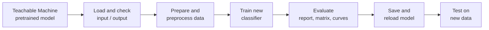

<div align="center">


<a href="https://git.io/typing-svg"></a>


</div>

---

## 📌 Overview

This project takes three models built in **Google Teachable Machine** (image, audio and pose) and goes one step further. Each model is loaded into its own Jupyter notebook, checked, and then used to **train a new classifier** on real data. Every notebook follows the same pipeline:

**Load → Check Input/Output → Prepare → Preprocess → Train → Evaluate → Visualize → Save → Reload → Test on New Data**

| # | Project | Type | Pretrained Teachable Machine model | What the notebook trains |
|---|---------|------|------------------------------------|--------------------------|
| 1 | Face Mask Detection | Image Processing | Keras image model (`keras_model.h5`) | Fine-tunes the classifier head on real with-mask / without-mask photos |
| 2 | Voice Event Detection | Audio Processing | TFLite audio model (`soundclassifier_with_metadata.tflite`) | Event-vs-Background classifier from audio features + the pretrained model's own prediction |
| 3 | Yoga Pose Detection | Pose Processing | TF.js pose model + Keras image model | Pose classifier on real `POSE_DATASET` photos, using CNN features |

---

## 🗂️ Project Structure

```text
PR. 4/
│
├── image processing/
│   ├── Project1_Image_Processing_Mask_Detection.ipynb
│   ├── mask_model_finetuned.keras          ← saved output of the notebook
│   ├── model/                              ← keras_model.h5, labels.txt
│   ├── images/
│   │   ├── with mask/                      ← 686 photos
│   │   └── without mask/                   ← 686 photos
│   └── Teachable Machine Model/            ← Image Processing.tm
│
├── voice detection/
│   ├── Project2_Voice_Detection.ipynb
│   ├── Project2_Voice_Detection (3).ipynb  ← latest version (adds manual audio test)
│   ├── voice_event_model.keras             ← saved output of the notebook
│   ├── voice_scaler.pkl                    ← saved output of the notebook
│   ├── model/                              ← soundclassifier_with_metadata.tflite, labels.txt
│   ├── test_dataset/                       ← down_001.wav, down_002.wav
│   └── Teachable Machine Model/            ← voice_detection.tm
│
└── pose_detection/
    ├── Project3_Pose_Detection.ipynb
    ├── pose_classifier.keras               ← saved output of the notebook
    ├── models/                             ← keras_model.h5, model.json, weights.bin, metadata.json
    ├── POSE_DATASET/
    │   ├── TRAIN/                          ← 1,081 photos (5 poses)
    │   └── TEST/                           ← 470 photos (5 poses)
    └── Teachable Machine Model/            ← POSE_DETECTION.tm
```

> `.ipynb_checkpoints` folders are auto-generated by Jupyter and can be ignored.

---

## 🧠 Project Details

### 1️⃣ Face Mask Detection — Image Processing

Fine-tunes a pretrained MobileNet-based CNN to tell **With Mask** from **Without Mask**.

| Item | Detail |
|------|--------|
| Notebook | `Project1_Image_Processing_Mask_Detection.ipynb` |
| Classes | `With Mask`, `Without Mask` |
| Model input | 224 × 224 RGB image, pixels scaled to −1 … 1 |
| Data used | 150 photos per class (300 total), 80 / 20 train-test split |
| Training | CNN feature extractor frozen, only the classifier head trained (Adam, lr 1e-4, 5 epochs, batch 16) |
| Extra | Feature maps of the first `Conv2D` layer are plotted to show what the CNN sees |
| Output | `mask_model_finetuned.keras` |

### 2️⃣ Voice Event Detection — Audio Processing

Decides whether a short audio clip is a sound **Event** or only **Background** noise.

| Item | Detail |
|------|--------|
| Notebook | `Project2_Voice_Detection (3).ipynb` (latest) |
| Pretrained model | 9 labels: Background Noise, Down, Left, No, On, Right, Stop, Up, Yes |
| Model input | 44,032 audio samples at 16 kHz |
| Data used | 300 generated clips (150 Event = tone bursts, 150 Background = quiet noise) |
| Features | RMS loudness, peak, zero-crossing rate, plus the pretrained model's label and confidence (13 features in total) |
| Split | 192 fit / 48 validation / 60 test clips |
| Classifier | Dense 16 → Dense 8 → Sigmoid (Adam, 20 epochs, batch 8) |
| Extra | Manual test section: type the path of any `.wav` file and get a prediction |
| Output | `voice_event_model.keras` and `voice_scaler.pkl` |

### 3️⃣ Yoga Pose Detection — Pose Processing

Classifies a photo into one of five yoga poses.

| Item | Detail |
|------|--------|
| Notebook | `Project3_Pose_Detection.ipynb` |
| Classes | `downdog`, `goddess`, `plank`, `tree`, `warrior2` |
| Data used | Up to 100 train photos and 40 test photos per pose |
| Features | CNN features taken from the MobileNet layers of the mask model (used as a frozen, offline feature extractor) |
| Classifier | Dense 64 → Dropout 0.3 → Softmax (Adam, 15 epochs, batch 16, 20% validation) |
| Extra | Feature maps of the first `Conv2D` layer are plotted |
| Output | `pose_classifier.keras` |

> **Why CNN features for pose?** The Teachable Machine pose model works on PoseNet keypoints, which need the browser (TF.js). To train on real photos in Python, the notebook loads the pose model's classifier weights for reference and uses the MobileNet CNN from the mask model to get features from the images.

---

## 🔄 Workflow



---

## 📊 Results

| Project | Test data | Test accuracy |
|---------|-----------|---------------|
| Face Mask Detection | 60 photos (30 per class) | **100%** |
| Voice Event Detection | 60 clips (30 Event, 30 Background) | **100%** |
| Yoga Pose Detection | 200 photos (40 per pose) | **95.5%** |

Each notebook also shows accuracy / loss curves, a classification report and a confusion matrix. The voice notebook adds an ROC curve.

**Points to note**
- The voice classifier is trained on generated tone / noise clips, so it separates Event from Background. It is not a speech-word recognizer. The two real clips in `test_dataset/` are only for the manual test.
- The mask model reaches 100% on a small, clean test set, so real-world photos may give lower results.
- Pose accuracy is the honest hold-out number, measured on photos that were never used in training.

---

## ⚙️ Setup

**1. Requirements**

- Python 3.10
- Jupyter Notebook or JupyterLab

**2. Install libraries**

```bash
pip install tensorflow tf_keras numpy pandas scipy scikit-learn matplotlib seaborn pillow joblib
```

**3. Model files**

Unzip each Teachable Machine export once, so the files sit directly on disk as shown in the [Project Structure](#️-project-structure). The notebooks do not contain any unzip code.

**4. Set the paths**

Each notebook has a **Configuration** cell at the top. Change only the paths and settings there (model paths, dataset folders, epochs, batch size). No values are hardcoded further down.

---

## ▶️ How to Run

1. Open the notebook of the project you want (start with Project 1).
2. Check the Configuration cell.
3. Run the cells from top to bottom (**Kernel → Restart & Run All**).
4. The trained model is saved in the same folder as the notebook.

> All notebooks use `import tf_keras as keras`. This avoids the Keras 3 error that appears when loading old Teachable Machine `.h5` models.

---

## 🔑 Key Concepts Covered

| Area | Concepts |
|------|----------|
| Deep learning | CNN, transfer learning, feature extraction, fine-tuning, dropout |
| Data | train / validation / test split, stratified split, scaling, one-hot encoding |
| Audio | RMS, peak, zero-crossing rate, sample rate |
| Evaluation | accuracy, precision, recall, F1-score, confusion matrix, ROC-AUC |
| Deployment | saving and reloading `.keras` models, predicting on a new image / audio file |

---

## 🧰 Tech Stack

`Python` · `TensorFlow / tf_keras` · `TFLite` · `scikit-learn` · `NumPy` · `pandas` · `SciPy` · `Matplotlib` · `Seaborn` · `Pillow` · `joblib` · `Google Teachable Machine`

---

## 👩‍🏫 Prepared By

**Red & White Skill Education** — Deep Learning Track, Project 4

<div align="center">


</div>
